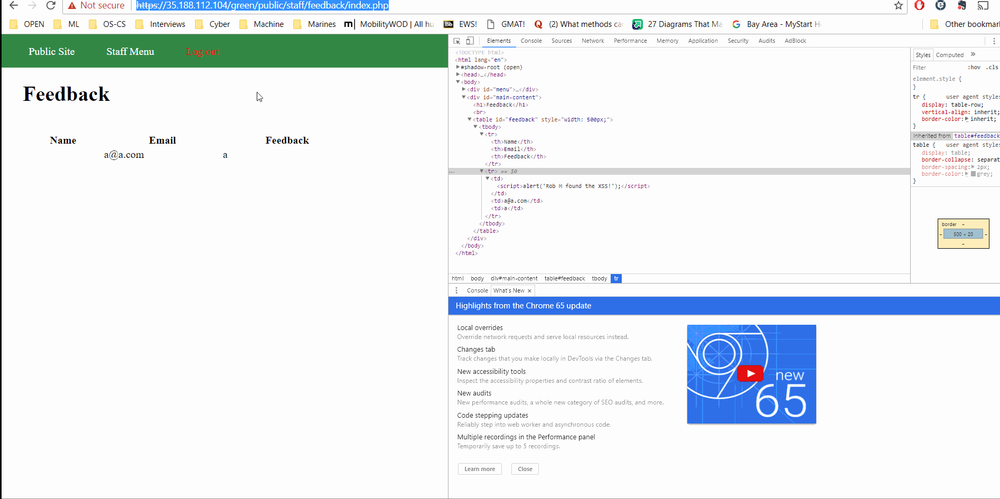
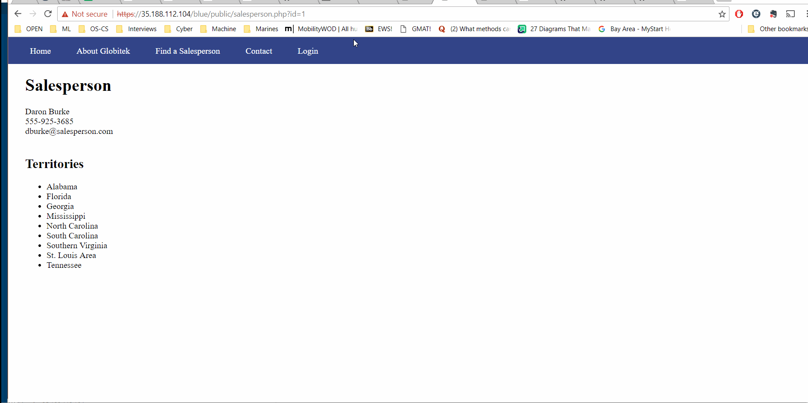
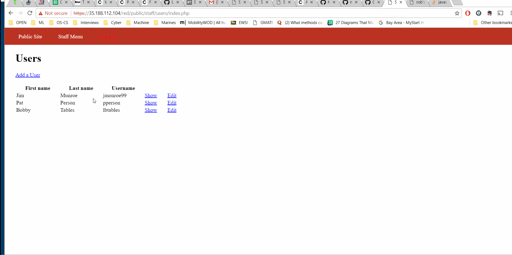

# Project 8 - Pentesting Live Targets

Time spent: **X** hours spent in total

> Objective: Identify vulnerabilities in three different versions of the Globitek website: blue, green, and red.

The six possible exploits are:
* Username Enumeration
* Insecure Direct Object Reference (IDOR)
* SQL Injection (SQLi)
* Cross-Site Scripting (XSS)
* Cross-Site Request Forgery (CSRF)
* Session Hijacking/Fixation

Each version of the site has been given two of the six vulnerabilities. (In other words, all six of the exploits should be assignable to one of the sites.)

## Blue

Vulnerability #1: SQLi

Here, the ID param is vulnerable to SQL injection.  Using the syntax, `id=' or 1=1 limit 3,1;-- '`
we are able to grab the third row from the database.

Vulnerability #2: Session Hijacking

Here you can see the Chrome browser (good user) and IE (hacker)
have different session Ids. The attacker gains access to the session ID
and sets their ID to be the same. despite having a different user agent, 
you can see they now have access to the logged-in area.

## Green

Vulnerability #1: Username Enumeration

We use the fact that real users have bold error messages,
while non-users are unbolded. We could script against this
to get more usernames.

Vulnerability #2: XSS

You can insert the XSS payload into the Name field of the contact form
on the Green page.  This script is then stuck into the HTML of the page
that the logged-in user visits, so it is stored XSS.

## Red

Vulnerability #1: IDOR

You can change the id field to access data that should not be accessible.
The other two sites redirect you to the territories.php site, most likely
by checking my access to the requested page and redirecting if I am not
authorized to view it.

Vulnerability #2: CSRF

The red site is vulnerable to CSRF with a logged in admin. A page like the
one hosted [here](https://github.com/rcmccartney/rcmccartney.github.io/blob/master/index.html)
will submit a hidden post request to change values in the database. Note that the attacker
can use a dummy iFrame to hide the redirect of the Post form, so has no idea that the db
has been modified.

## Notes

Describe any challenges encountered while doing the work
